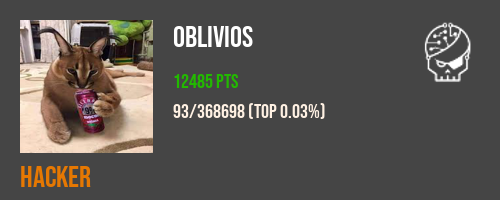

<h1 align="center"><b>Hey! 🕵️</b></h1>

## Stats 📈

                

## Languages ⛩️

       

## Tools 🌠

  

## Ranks 🌌

<table align="center">
                <tr>
                    <td align="center">⤳ Codewars:</td>
                    <td align="center"></td>
                    <td align="center"><a href="https://www.codewars.com/users/Oblivios"></img></a></td>
                </tr>
                <tr>
                    <td align="center">⤳ TryHackMe:</td>
                    <td align="center"></td>
                    <td align="center"></td>
                </tr>
                <tr>
                    <td align="center">⤳ RootMe:</td>
                    <td align="center"></td>
                    <td align="center"></td></td>
                </tr>
                <tr>
                    <td align="center">⤳ CryptoHack:</td>
                    <td align="center"></td>
                    <td align="center"></td>
                </tr>
            </table>
